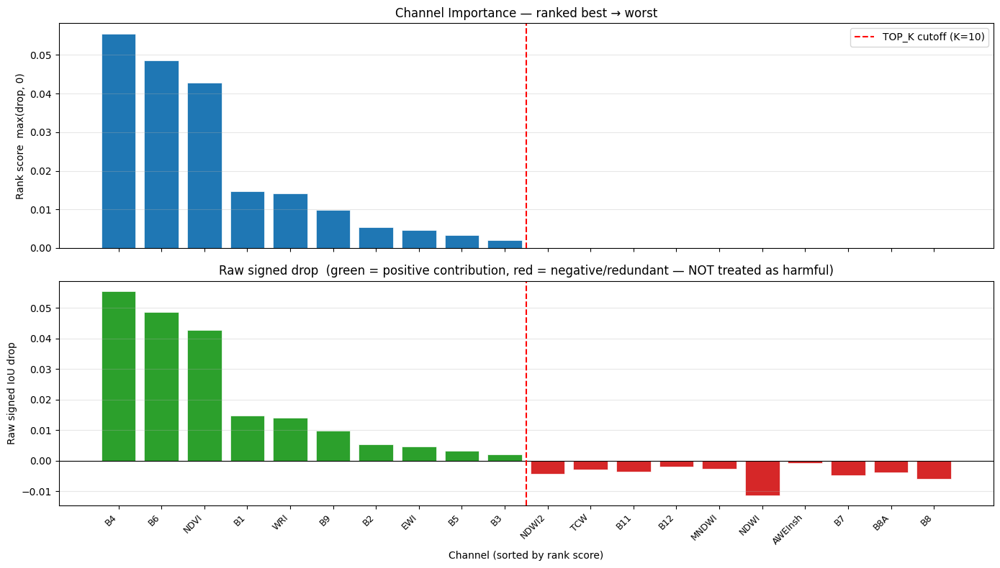
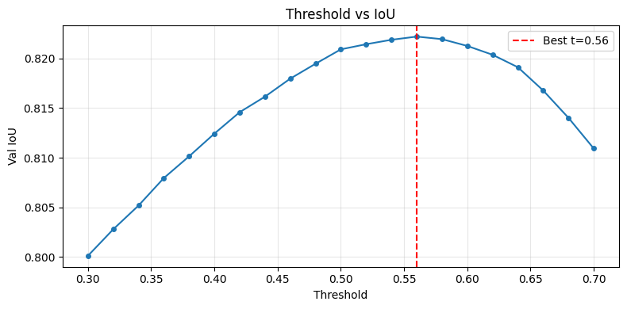
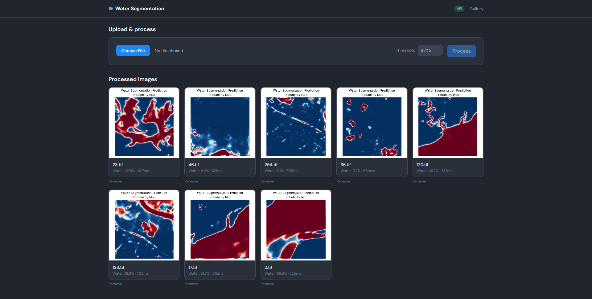
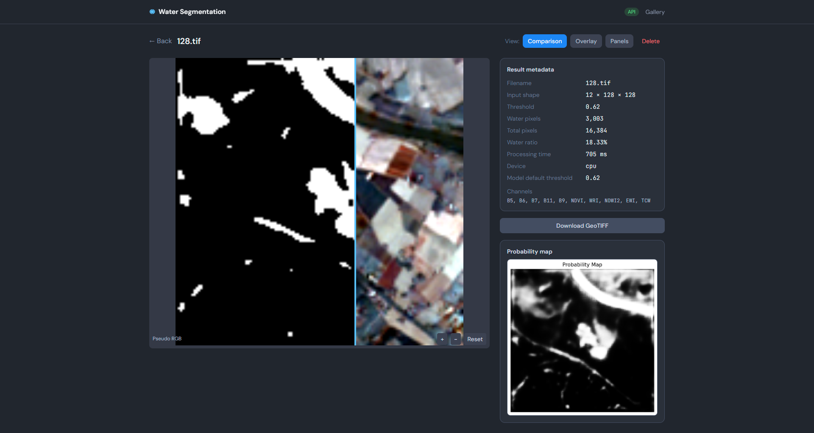
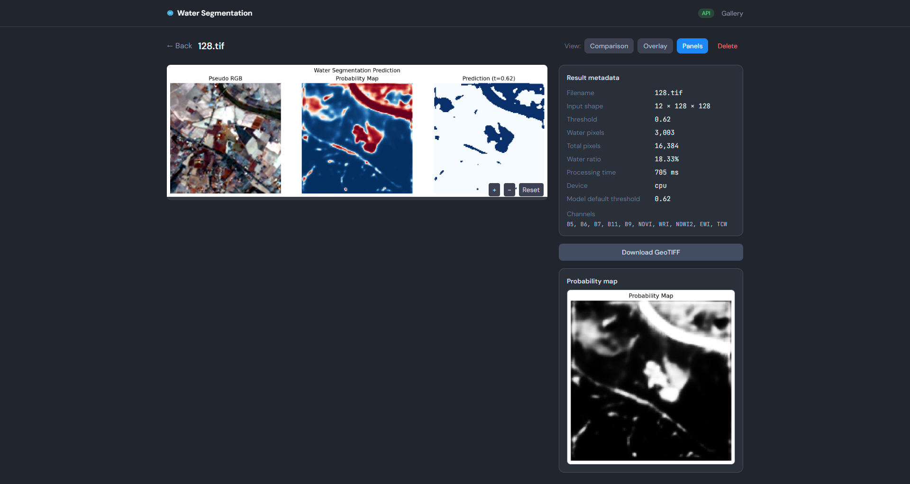
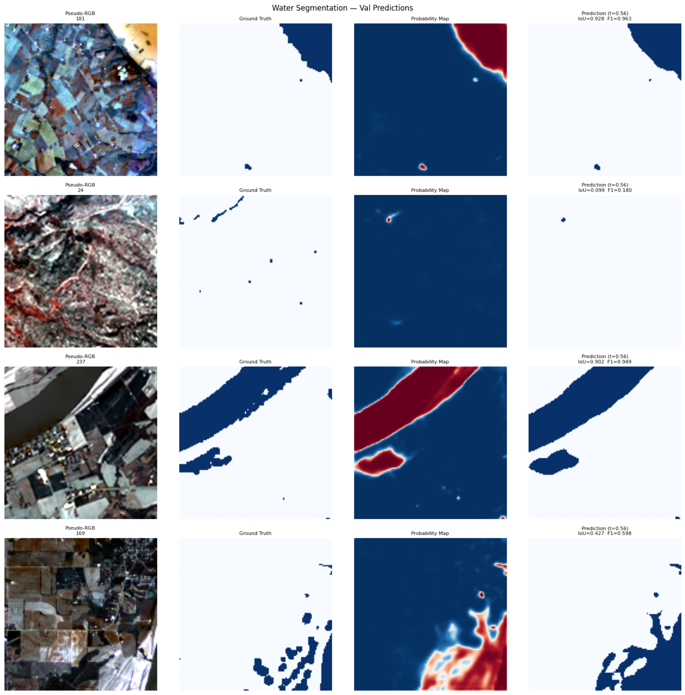

# Water Segmentation API

Production-style FastAPI service for the uploaded PyTorch water-segmentation model. The service reconstructs the feature-engineering pipeline from the notebook, loads the trained checkpoint, and exposes prediction endpoints for JSON summaries, PNG masks, probability maps, GeoTIFF masks, and notebook-style visualization panels.

## What this package includes

- Reconstructed `DeepChannelAdapter + UnetPlusPlus(efficientnet-b4)` model
- Exact selected channels recovered from the notebook
- Saved inference configuration in `configs/model_config.json`
- FastAPI endpoints for raw prediction and visualization
- Dockerfile for containerized deployment
- GeoTIFF mask export that preserves raster metadata

## Model facts recovered from the notebook

- Raw Sentinel-2 band order:
  `B2, B3, B4, B5, B6, B7, B8, B8A, B11, B12, B1, B9`
- Engineered indices:
  `NDWI, MNDWI, AWEInsh, NDVI, WRI, NDWI2, EWI, TCW`
- Selected channels actually used by the trained model:
  `B5, B6, B7, B11, B9, NDVI, WRI, NDWI2, EWI, TCW`
- Best validation threshold found in the notebook:
  `0.62`

### Channel importance

The following plot shows the relative importance of the selected input channels used by the model:



### Threshold search

The optimal binary threshold was determined via validation; the figure below illustrates the threshold search that yielded the default value of 0.62:



## Web frontend

A responsive React frontend is provided for uploading images, viewing results in a gallery, and inspecting predictions with comparison slider, overlay, and zoom/pan.



Detail view with comparison slider and overlay:





### Development (frontend + API)

1. Start the API (from project root):
   ```bash
   cd app && uvicorn main:app --host 0.0.0.0 --port 8000
   ```
2. In another terminal, start the frontend dev server (proxies API to `http://localhost:8000`):
   ```bash
   cd frontend && npm install && npm run dev
   ```
3. Open http://localhost:5173

### Production build (single server)

1. Build the frontend:
   ```bash
   cd frontend && npm run build
   ```
2. Start the API; it will serve the built frontend from `/` and the API from `/api`:
   ```bash
   cd app && uvicorn main:app --host 0.0.0.0 --port 8000
   ```
3. Open http://localhost:8000

Optional: set `VITE_API_URL` when building the frontend to point to a different API origin (e.g. `https://api.example.com`).

## API endpoints

All API routes are mounted under `/api` when using the frontend. Direct usage examples below use the prefix for consistency.

### `GET /api/health`
Returns device, threshold, selected channels, and expected raw band order.

### `POST /api/predict`
Returns JSON with water pixel statistics.

### `POST /api/predict/mask`
Returns a binary PNG mask.

### `POST /api/predict/probability`
Returns a grayscale PNG probability map.

### `POST /api/predict/visualization`
Returns a notebook-style panel image. The layout matches the example below (pseudo-RGB, optional ground truth, probability map, and prediction with optional IoU/F1 when a mask is provided):



### `POST /api/predict/pseudo_rgb`
Returns a pseudo-RGB preview of the input raster as PNG (for frontend comparison).

Accepted inputs:
- `file`: required multi-band `.tif` or `.tiff`
- `mask`: optional single-band ground-truth `.tif` or `.tiff`
- `threshold`: optional override

If `mask` is provided, the response includes a four-panel layout:
- Pseudo RGB
- Ground Truth
- Probability Map
- Prediction with IoU and F1 in the title

If no mask is provided, the response includes a three-panel layout:
- Pseudo RGB
- Probability Map
- Prediction

### `POST /predict/geotiff`
Returns a single-band GeoTIFF mask while preserving spatial metadata from the uploaded raster.

## Run locally

```bash
python -m venv .venv
source .venv/bin/activate
pip install -r requirements.txt
cd app
uvicorn main:app --host 0.0.0.0 --port 8000
```

## Run with Docker

```bash
docker build -t water-segmentation-api .
docker run --rm -p 8000:8000 water-segmentation-api
```

## Example requests

### JSON summary

```bash
curl -X POST \
  -F "file=@sample.tif" \
  http://localhost:8000/api/predict
```

### Visualization panel (output similar to figure above)

```bash
curl -X POST \
  -F "file=@sample.tif" \
  -F "mask=@sample_mask.tif" \
  http://localhost:8000/api/predict/visualization \
  --output test_predictions.png
```

### GeoTIFF mask

```bash
curl -X POST \
  -F "file=@sample.tif" \
  http://localhost:8000/api/predict/geotiff \
  --output predicted_mask.tif
```

## Notes

- The service expects the same 12-band order used during training.
- The model checkpoint is a state dict, not a serialized full model.
- The normalization statistics and selected-channel definition are now stored explicitly in `configs/model_config.json` so deployment does not depend on the notebook anymore.
