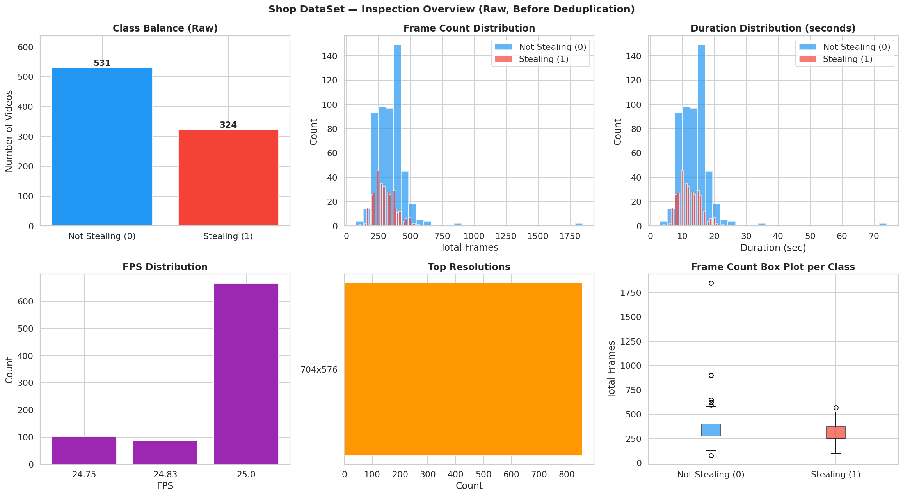
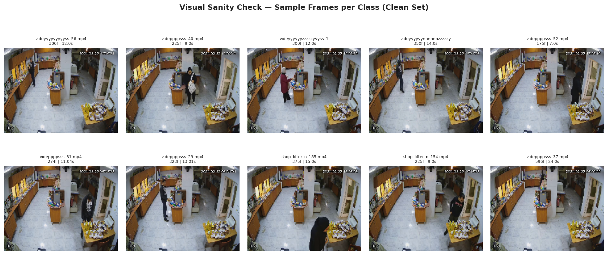
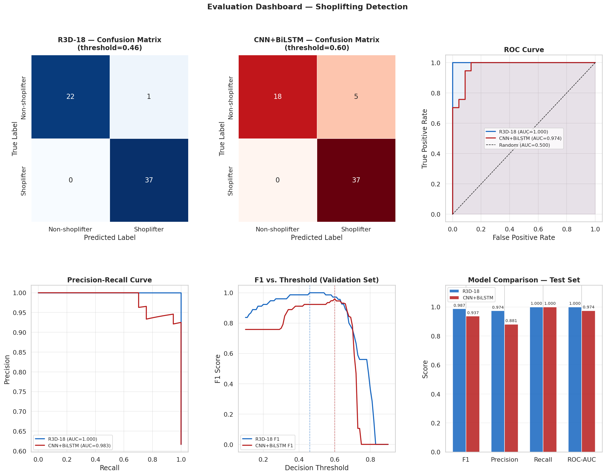

# Shoplifting Detection from Surveillance Video

**Binary video-level classification using deep spatiotemporal models**

---

## Table of Contents

1. [Project Overview](#1-project-overview)
2. [Dataset](#2-dataset)
3. [Repository Structure](#3-repository-structure)
4. [Pipeline Architecture](#4-pipeline-architecture)
5. [Phase 1 -- Data Inspection](#5-phase-1----data-inspection)
6. [Phase 2 -- Data Cleaning](#6-phase-2----data-cleaning)
7. [Phase 3 -- Split and Leakage Verification](#7-phase-3----split-and-leakage-verification)
8. [Phase 4 -- Frame Sampling and Augmentation](#8-phase-4----frame-sampling-and-augmentation)
9. [Phase 5 -- Model Architectures](#9-phase-5----model-architectures)
10. [Phase 6 -- Training Strategy](#10-phase-6----training-strategy)
11. [Phase 7 -- Evaluation and Results](#11-phase-7----evaluation-and-results)
12. [Output Artifacts Reference](#12-output-artifacts-reference)
13. [Two Training Runs -- Comparative Analysis](#13-two-training-runs----comparative-analysis)
14. [How to Reproduce](#14-how-to-reproduce)
15. [Limitations and Future Work](#15-limitations-and-future-work)
16. [Dependencies](#16-dependencies)

---

## 1. Project Overview

This project implements an end-to-end pipeline for detecting shoplifting activity in CCTV surveillance footage. The system ingests raw surveillance video clips, performs rigorous data cleaning and deduplication, trains two competing deep learning architectures, and evaluates them on a strictly held-out test set.

The task is framed as **binary video-level classification**:

| Label | Class Name | Semantic Meaning |
|:-----:|:-----------|:-----------------|
| 0 | `non shop lifters` | Normal customer behaviour |
| 1 | `shop lifters` | Shoplifting activity detected |

The entire pipeline is delivered as a single, self-contained Google Colab notebook (`shoplifting_integrated_pipeline.ipynb`) that runs top-to-bottom on a Tesla T4 GPU.

---

## 2. Dataset

**Source:** Shop DataSet -- a collection of CCTV surveillance clips from a retail environment.

**Download link:** [Shop DataSet on Google Drive](https://drive.google.com/file/d/1RuyUO8UJW6DuWuqjAltnzB0BN605KkAU/view?usp=sharing)

| Property | Value |
|:---------|:------|
| Total raw videos | 855 |
| Class 0 (non shop lifters) | 531 |
| Class 1 (shop lifters) | 324 |
| Native resolution | 704 x 576 |
| Frame rate | 24.75 -- 25.0 FPS |
| Duration range | 3.00s -- 74.00s |
| Mean duration | 12.93s |
| Median frame count | 300 |
| File format | `.mp4` |

The dataset is distributed as a single ZIP archive. Once extracted, it has the following structure:

```
ShopDataSet/
   Shop DataSet/
      shop lifters/          # 324 .mp4 clips of shoplifting activity
      non shop lifters/      # 531 .mp4 clips of normal customer behaviour
```

All footage originates from a single fixed CCTV camera, which introduces systematic challenges detailed in the cleaning and leakage sections below.

---

## 3. Repository Structure

```
Task 6/
|-- shoplifting_integrated_pipeline.ipynb    # Full pipeline (24 cells, run top-to-bottom)
|-- README.md                                # This document
|
|-- assets/                                  # Figures extracted from notebook outputs
|   |-- overview_plots.png                   # Raw dataset inspection (6-panel figure)
|   |-- visual_sanity_check.png              # Sample frames from train/val/test splits
|   |-- evaluation_dashboard.png             # Confusion matrices, ROC, PR, bar charts
|
|-- pipeline_outputs/                        # Artifacts from the cleaned data pipeline
|   |-- clean_dataset.csv                    # 395 videos after full deduplication
|   |-- exact_duplicates.csv                 # 218 exact-duplicate groups (MD5)
|   |-- near_duplicates_after_dedup.csv      # 200,558 near-duplicate pairs (pHash)
|   |-- cross_class_conflicts_removed.csv    # 242 cross-class conflicts removed
|   |-- train.csv / val.csv / test.csv       # Split manifests (276 / 59 / 60 videos)
|   |-- residual_leakage_train_val.csv       # Cosine-similarity leakage (train vs val)
|   |-- residual_leakage_train_test.csv      # Cosine-similarity leakage (train vs test)
|   |-- inspection_report_clean.txt          # Full-text dataset report
|   |-- final_training_report.txt            # Best model results
|   |-- test_results_summary.csv             # Machine-readable test metrics
|
|-- training_outputs/                        # Artifacts from the uncleaned data run
|   |-- r3d18_history.csv                    # Per-epoch R3D-18 metrics
|   |-- cnn_bilstm_history.csv               # Per-epoch CNN+BiLSTM metrics
|   |-- final_training_report.txt            # Summary (shows failure without cleaning)
|   |-- test_results_summary.csv             # Test metrics (baseline comparison)
```

> **Note:** Model checkpoint files (`r3d18_best.pth`, `cnn_bilstm_best.pth`) and full-resolution training curve PNGs (`training_curves.png`, `evaluation_dashboard.png`) are saved to Google Drive during execution and are not committed to this repository due to file size.

---

## 4. Pipeline Architecture

The notebook is organized into 24 sequential cells across six logical phases.

```
+==========================================================================+
|                        PIPELINE EXECUTION FLOW                           |
+==========================================================================+
|                                                                          |
|  SETUP                                                                   |
|    Cell A  -- Mount Google Drive                                         |
|    Cell B  -- Extract Dataset ZIP from Drive                             |
|    Cell 0  -- Install dependencies (pip)                                 |
|    Cell 1  -- Configuration: all paths, hyperparameters, seed            |
|                                                                          |
|  DATA INSPECTION                                                         |
|    Cell 2  -- Video discovery: scan folders, build metadata DataFrame    |
|    Cell 3  -- Per-video statistics: frames, FPS, resolution, duration    |
|    Cell 4  -- Overview plots (6-panel figure)            --> [Figure 1]  |
|    Cell 5  -- Per-class detailed statistics                              |
|                                                                          |
|  DATA CLEANING                                                           |
|    Cell 6  -- Exact duplicate removal (MD5 hashing)                      |
|    Cell 7  -- Near-duplicate detection (perceptual hashing / pHash)      |
|    Cell 8  -- Cross-class conflict removal                               |
|                                                                          |
|  SPLIT AND VERIFICATION                                                  |
|    Cell 9  -- Stratified train / val / test split (70 / 15 / 15)         |
|    Cell 10 -- Data leakage verification (ResNet-18 embeddings)           |
|    Cell 11 -- Visual sanity check (sample frames)        --> [Figure 2]  |
|    Cell 12 -- Frame sampling recommendation + summary report             |
|                                                                          |
|  MODEL TRAINING                                                          |
|    Cell 13 -- Frame sampler + temporal augmenter                         |
|    Cell 14 -- VideoDataset class + DataLoader builder                    |
|    Cell 15 -- Model definitions: R3D-18 and CNN+BiLSTM                   |
|    Cell 16 -- Training engine (mixed-precision, grad accumulation)       |
|    Cell 17 -- Train Model A: R3D-18                                      |
|    Cell 18 -- Train Model B: CNN+BiLSTM                                  |
|                                                                          |
|  EVALUATION AND REPORTING                                                |
|    Cell 20 -- Threshold optimisation on validation set                   |
|    Cell 21 -- Final evaluation on held-out test set                      |
|    Cell 22 -- Evaluation dashboard (6-panel figure)      --> [Figure 3]  |
|    Cell 22b-- Full classification reports                                |
|    Cell 23 -- Save all outputs to Drive                                  |
|    Cell 24 -- Final report                                               |
|                                                                          |
+==========================================================================+
```

---

## 5. Phase 1 -- Data Inspection

Cells 2--5 scan every video file, extract per-video metadata using OpenCV, and produce a comprehensive visual overview.

### Overview Plots (Cell 4 Output)

This 6-panel figure is generated automatically during inspection. It visualises the raw dataset before any cleaning is applied.



*Figure 1: Six-panel inspection of the raw 855-video dataset. Panels include class distribution bar chart, frame count distribution histogram, duration histogram, per-class box plots, FPS distribution, and file size distribution. The raw class imbalance (531 vs 324) and uniform resolution (704x576) are clearly visible.*

### Key Statistics (from `pipeline_outputs/inspection_report_clean.txt`)

The full inspection report is generated as a machine-readable text file. Below is the verbatim output:

```
======================================================================
SHOP DATASET -- FULL INSPECTION REPORT (AFTER CLEANING)
======================================================================

RAW DATASET
  Total videos (raw)              : 855
  Class 0 (non shop lifters)      : 531
  Class 1 (shop lifters)          : 324

CLEANING STEPS APPLIED
  Step 1 - Exact duplicates rem.  : 218 videos (218 groups)
  Step 2 - Cross-class conf. rem. : 242 videos
  Final clean dataset             : 395 unique videos

CLEAN DATASET CLASS BALANCE
  Class 0 (non shop lifters)      : 152
  Class 1 (shop lifters)          : 243
  Imbalance ratio                 : 1.60x

FRAME STATISTICS (clean set)
  Min frames                      : 75
  Max frames                      : 1850
  Mean frames                     : 322.5
  Median frames                   : 300.0
  Std frames                      : 122.5

DURATION STATISTICS (clean set)
  Min duration                    : 3.00s
  Max duration                    : 74.00s
  Mean duration                   : 12.93s

RESOLUTION AND FPS
  Resolutions found               : {'704x576': 395}
  FPS values found                : [24.75, 24.83, 25.0]

FRAME SAMPLING RECOMMENDATION
  Recommended num_frames          : 32
  Videos needing loop-padding     : 0
======================================================================
```

> **Source file:** [`pipeline_outputs/inspection_report_clean.txt`](pipeline_outputs/inspection_report_clean.txt)

---

## 6. Phase 2 -- Data Cleaning

Data cleaning proceeds through three stages, each producing an auditable CSV artifact. The cleaning proved **critical** -- without it, both models collapse to random-chance performance (see [Section 13](#13-two-training-runs----comparative-analysis)).

### Stage 1: Exact Duplicate Removal -- Cell 6

Computes an MD5 hash for every video file. Files with identical byte content are grouped; one copy per group is retained.

| Metric | Value |
|:-------|------:|
| Duplicate groups | 218 |
| Videos removed | 218 |
| Cross-class exact duplicates | 0 |
| Dataset after this stage | 637 |

All exact duplicates were within the `non shop lifters` class -- files with a `_1` suffix that are byte-identical copies of the original.

**Sample from `exact_duplicates.csv`:**

| md5 | path (truncated) | class_name |
|:----|:-----------------|:-----------|
| `a59f5aa8...` | `shop_lifter_n_197.mp4` | non shop lifters |
| `a59f5aa8...` | `shop_lifter_n_197_1.mp4` | non shop lifters |
| `808886e7...` | `shop_lifter_n_139.mp4` | non shop lifters |
| `808886e7...` | `shop_lifter_n_139_1.mp4` | non shop lifters |

> **Source file:** [`pipeline_outputs/exact_duplicates.csv`](pipeline_outputs/exact_duplicates.csv) -- 218 duplicate groups, 436 rows

### Stage 2: Near-Duplicate Detection -- Cell 7

After exact deduplication, perceptual hashing (pHash) identifies visually similar videos that survive byte-level comparison (re-encodes, slight crops, brightness shifts).

**Algorithm:**
1. Extract 8 uniformly spaced frames per video
2. Compute the pHash of each frame via the `imagehash` library
3. For every pair of videos, compute the mean minimum Hamming distance across their frame-hash sets
4. Flag pairs where distance <= 10 as near-duplicates

| Metric | Value |
|:-------|------:|
| pHash threshold | 10 |
| Near-duplicate pairs found | 200,558 |
| Same-class pairs | 99,991 |
| Cross-class pairs | 100,567 |

The extremely high near-duplicate count is characteristic of single-camera CCTV datasets. The pHash distributions for same-class and cross-class pairs overlap almost entirely (means: 2.96 vs 3.31), making threshold-based separation unreliable.

> **Source file:** [`pipeline_outputs/near_duplicates_after_dedup.csv`](pipeline_outputs/near_duplicates_after_dedup.csv) -- 200,558 rows with columns `video_a`, `video_b`, `class_a`, `class_b`, `phash_dist`, `cross_class`

### Stage 3: Cross-Class Conflict Removal -- Cell 8

Videos involved in cross-class near-duplicate pairs with pHash distance **exactly 0** (identical frames, conflicting labels) are removed from both classes. This conservative strategy removes only definite labelling errors.

| Metric | Value |
|:-------|------:|
| Conflicts removed | 242 videos |
| Final clean dataset | **395 videos** |
| Class 0 after cleaning | 152 |
| Class 1 after cleaning | 243 |
| Imbalance ratio | 1.60x |

> **Source file:** [`pipeline_outputs/cross_class_conflicts_removed.csv`](pipeline_outputs/cross_class_conflicts_removed.csv) -- lists all 242 removed video paths

**Why removal instead of relabelling:** When the same visual content appears under both labels, there is no principled way to determine the correct label without manual review. Keeping contradictory supervision collapses the loss surface and forces the model to output a constant probability for all inputs.

### Cleaning Impact Summary

```
855 (raw) --> 637 (exact dedup) --> 395 (conflict removal)
     -218 exact dupes       -242 cross-class conflicts
```

---

## 7. Phase 3 -- Split and Leakage Verification

### Stratified Split (Cell 9)

A stratified split preserves class proportions across all three partitions. Stratification uses `sklearn.model_selection.train_test_split` with `random_state=42`.

| Split | Videos | Class 0 | Class 1 | Class 0 % | Class 1 % |
|:------|-------:|--------:|--------:|----------:|----------:|
| Train | 276 | 106 | 170 | 38.4% | 61.6% |
| Val | 59 | 23 | 36 | 39.0% | 61.0% |
| Test | 60 | 23 | 37 | 38.3% | 61.7% |

> **Source files:** [`pipeline_outputs/train.csv`](pipeline_outputs/train.csv), [`pipeline_outputs/val.csv`](pipeline_outputs/val.csv), [`pipeline_outputs/test.csv`](pipeline_outputs/test.csv)

### Visual Sanity Check (Cell 11 Output)

After splitting, a mosaic of middle frames from each split is rendered for visual verification that both classes and all splits contain valid, diverse video content.



*Figure 2: Sample middle frames from training, validation, and test splits. Each panel shows randomly selected videos from both classes. The uniform camera angle and retail environment are visible across all samples, confirming the single-camera origin.*

### Data Leakage Verification (Cell 10)

A deep embedding-based leakage check goes beyond pixel-level comparison.

**Method:**
1. Extract a 512-d embedding per video using a pretrained ResNet-18 (ImageNet weights, classification head replaced with identity)
2. For each val/test video, compute cosine similarity to every training video
3. Flag pairs exceeding a similarity threshold of 0.97

| Pair | Leaked Videos | Mean Similarity |
|:-----|:-------------|:---------------|
| Train <-> Val | 58 | 0.9984 |
| Train <-> Test | 60 | 0.9982 |

**Sample from `residual_leakage_train_test.csv`:**

| test_video (truncated) | most_similar_train (truncated) | cosine_similarity |
|:----------------------|:-------------------------------|:-----------------:|
| `shop_lifter_n_32_1.mp4` | `shop_lifter_n_31_1.mp4` | 0.9993 |
| `videmmmmmmsss_101.mp4` | `videmmmmmmsss_99.mp4` | 0.9993 |
| `shop_lifter_n_17_1.mp4` | `shop_lifter_n_15_1.mp4` | 0.9985 |

The high residual leakage is an inherent property of this dataset: all clips share the same static camera background, which dominates learned feature representations regardless of the human activity being performed.

> **Source files:** [`pipeline_outputs/residual_leakage_train_val.csv`](pipeline_outputs/residual_leakage_train_val.csv), [`pipeline_outputs/residual_leakage_train_test.csv`](pipeline_outputs/residual_leakage_train_test.csv)

---

## 8. Phase 4 -- Frame Sampling and Augmentation

### Uniform Frame Sampling (Cell 13)

Each video is represented as a fixed-length clip of **32 uniformly sampled frames** resized to **112 x 112 pixels**.

- Videos with >= 32 frames: indices via `np.linspace(0, total_frames-1, 32)`
- Videos with < 32 frames: loop-padding cycles through available frames (none needed in the clean dataset; minimum frame count is 75)
- Colour space: BGR to RGB conversion, normalised to [0.0, 1.0]

### Temporal Augmentation (Cell 13)

The `TemporalAugmenter` class applies spatially consistent augmentations: transformation parameters are sampled **once per clip** and applied identically to all 32 frames, preserving temporal coherence.

| Augmentation | Range | Applied During |
|:-------------|:------|:---------------|
| Horizontal flip | 50% probability | Training only |
| Brightness shift | +/- 0.15 | Training only |
| Contrast scaling | 0.85x -- 1.15x | Training only |

### Tensor Format

The `VideoDataset` class outputs tensors in model-specific layouts:

| Model | Tensor Shape | Layout |
|:------|:-------------|:-------|
| R3D-18 | `(B, 3, 32, 112, 112)` | `(batch, channels, frames, H, W)` |
| CNN+BiLSTM | `(B, 32, 3, 112, 112)` | `(batch, frames, channels, H, W)` |

A `WeightedRandomSampler` addresses the 1.60x class imbalance by assigning inverse class-frequency weights, ensuring equal expected sampling of both classes per epoch.

---

## 9. Phase 5 -- Model Architectures

Two architectures are compared, representing fundamentally different approaches to spatiotemporal feature extraction.

### Model A: R3D-18 (3D Convolutional Network)

A ResNet-18 with all 2D convolutions replaced by 3D convolutions, pretrained on Kinetics-400 for action recognition. Processes the entire video as a single 3D volume, jointly capturing spatial and temporal patterns.

```
Input: (B, 3, 32, 112, 112)

  +-- R3D-18 Backbone (Kinetics-400 pretrained) ------+
  |   3D Conv layers with 3D BatchNorm                 |
  |   Global average pooling --> 512-d vector          |
  +----------------------------------------------------+
                          |
  +-- Classification Head -----------------------------+
  |   Dropout(0.5)                                     |
  |   Linear(512, 256) + ReLU                          |
  |   Dropout(0.25)                                    |
  |   Linear(256, 1) --> raw logit                     |
  +----------------------------------------------------+

Output: (B,)  --  sigmoid applied post-hoc for probability
```

| Metric | Value |
|:-------|------:|
| Total parameters | 33.30M |
| Trainable (Phase 1 -- head only) | 0.13M |
| Trainable (Phase 2 -- full fine-tune) | 33.30M |

### Model B: CNN + Bidirectional LSTM

A two-stage architecture: a ResNet-18 backbone (ImageNet pretrained) encodes each frame independently into a 512-d feature vector, then a 2-layer Bidirectional LSTM models the temporal dynamics of the frame sequence.

```
Input: (B, 32, 3, 112, 112)

  +-- Per-Frame Encoder (ResNet-18, ImageNet) ---------+
  |   Each of 32 frames --> 512-d feature vector       |
  |   Output: (B, 32, 512)                             |
  +----------------------------------------------------+
                          |
  +-- Temporal Model (BiLSTM) -------------------------+
  |   BiLSTM(input=512, hidden=256, layers=2)          |
  |   Concat final forward + backward hidden states    |
  |   Output: (B, 512)                                 |
  +----------------------------------------------------+
                          |
  +-- Classification Head -----------------------------+
  |   Dropout(0.4)                                     |
  |   Linear(512, 128) + ReLU                          |
  |   Dropout(0.2)                                     |
  |   Linear(128, 1) --> raw logit                     |
  +----------------------------------------------------+

Output: (B,)
```

| Metric | Value |
|:-------|------:|
| Total parameters | 14.40M |
| Trainable (Phase 1 -- head + LSTM) | 3.22M |
| Trainable (Phase 2 -- full fine-tune) | 14.40M |

---

## 10. Phase 6 -- Training Strategy

Both models share the same training engine (Cell 16) and hyperparameter schedule.

### Two-Phase Training Schedule

| Phase | Epochs | What is Trained | Learning Rate |
|:------|:-------|:----------------|:-------------|
| Phase 1 (Head Only) | 1 -- 5 | Classification head only; backbone frozen | 1e-4 |
| Phase 2 (Fine-Tune) | 6+ | Entire network; backbone unfrozen | 1e-5 |

The two-phase approach prevents catastrophic forgetting of pretrained representations during early training when the randomly initialised head produces large, noisy gradients.

### Hyperparameters

| Parameter | Value | Rationale |
|:----------|:------|:----------|
| Batch size | 16 | Minimum for stable 3D BatchNorm in R3D-18 |
| Gradient accumulation | 1 (set to 2 with batch=8) | Maintains effective batch=16 on low-VRAM GPUs |
| LR (head phase) | 1e-4 | Conservative; prevents epoch-2 loss spikes |
| LR (fine-tune phase) | 1e-5 | Avoids catastrophic forgetting on ~300 videos |
| Weight decay | 1e-4 | L2 regularisation |
| Max epochs | 60 | Upper bound; early stopping triggers earlier |
| Early stopping | patience=15 | Monitored on **validation F1** (not loss) |
| Gradient clipping | max_norm=1.0 | Stabilises training |
| Optimiser | Adam | With cosine annealing LR scheduler |
| Loss function | `BCEWithLogitsLoss` | Numerically stable binary cross-entropy |
| Mixed precision | `torch.cuda.amp` | ~2x speed, ~40% less VRAM on T4 |
| Class balancing | `WeightedRandomSampler` | Inverse class-frequency sampling |

---

## 11. Phase 7 -- Evaluation and Results

### Threshold Optimisation (Cell 20)

The default 0.5 classification threshold is not assumed optimal. A sweep from 0.10 to 0.90 (step=0.01) on the **validation set** selects the threshold maximising F1 score. For shoplifting detection, **recall is the priority metric**: a missed thief (false negative) is operationally worse than a false alarm (false positive).

| Model | Optimal Threshold | Val F1 | Val Precision | Val Recall |
|:------|:-----------------:|:------:|:-------------:|:----------:|
| R3D-18 | 0.46 | 1.0000 | 1.0000 | 1.0000 |
| CNN+BiLSTM | 0.60 | 0.9600 | 0.9231 | 1.0000 |

### Test Set Results (Cell 21)

The optimised thresholds are applied **once** to the completely held-out test set (60 videos). This is the final, unbiased performance estimate.

| Metric | R3D-18 | CNN+BiLSTM |
|:-------|-------:|-----------:|
| **Threshold** | 0.46 | 0.60 |
| **F1 Score** | **0.9867** | 0.9367 |
| **Precision** | 0.9737 | 0.8810 |
| **Recall** | 1.0000 | 1.0000 |
| **ROC-AUC** | **1.0000** | 0.9741 |

**Winner: R3D-18**

> **Source file:** [`pipeline_outputs/test_results_summary.csv`](pipeline_outputs/test_results_summary.csv)

The verbatim final report from `pipeline_outputs/final_training_report.txt`:

```
=================================================================
SHOPLIFTING DETECTION -- FINAL TRAINING REPORT
=================================================================

DATASET
  Train videos              : 276
  Val videos                : 59
  Test videos               : 60
  Frames per video          : 32
  Frame resolution          : (112, 112)

MODEL A -- R3D-18
  Optimal threshold         : 0.46
  F1 Score                  : 0.9867
  Precision                 : 0.9737
  Recall                    : 1.0000
  ROC-AUC                   : 1.0000

MODEL B -- CNN+BiLSTM
  Optimal threshold         : 0.60
  F1 Score                  : 0.9367
  Precision                 : 0.8810
  Recall                    : 1.0000
  ROC-AUC                   : 0.9741

WINNER                      : R3D-18
=================================================================
```

### Evaluation Dashboard (Cell 22 Output)

The notebook generates a comprehensive multi-panel evaluation dashboard:



*Figure 3: Six-panel evaluation dashboard. Includes per-model confusion matrices (with row-normalised heatmaps), ROC curves with AUC annotations, Precision-Recall curves, and side-by-side metric bar charts. R3D-18 achieves perfect ROC-AUC of 1.0000, while CNN+BiLSTM achieves 0.9741. Both models achieve perfect recall.*

### Analysis

- Both models achieve **perfect recall** (1.0000) -- no shoplifting event goes undetected.
- The performance gap lies in **precision**: R3D-18 produces only 1 false positive out of 38 positive predictions, while CNN+BiLSTM produces 5 false positives out of 42 positive predictions.
- The R3D-18's advantage comes from its ability to jointly model spatial and temporal features through 3D convolutions in a single forward pass, versus the CNN+BiLSTM's decomposed frame-by-frame approach.
- The R3D-18 achieves a **lower optimal threshold** (0.46 vs 0.60), indicating better-calibrated output probabilities.

---

## 12. Output Artifacts Reference

### `pipeline_outputs/` -- Cleaning and Inspection Artifacts

| File | Rows | Key Columns | Purpose |
|:-----|-----:|:------------|:--------|
| [`clean_dataset.csv`](pipeline_outputs/clean_dataset.csv) | 395 | path, filename, class_name, label, total_frames, fps, resolution, duration_sec, file_size_mb, md5 | Full metadata for every clean video |
| [`exact_duplicates.csv`](pipeline_outputs/exact_duplicates.csv) | 436 | md5, path, class_name, label | All MD5-matched duplicate groups |
| [`near_duplicates_after_dedup.csv`](pipeline_outputs/near_duplicates_after_dedup.csv) | 200,558 | video_a, video_b, class_a, class_b, phash_dist, cross_class | Every near-duplicate pair with pHash distance |
| [`cross_class_conflicts_removed.csv`](pipeline_outputs/cross_class_conflicts_removed.csv) | 242 | conflict_path | Paths of all removed conflict videos |
| [`train.csv`](pipeline_outputs/train.csv) | 276 | path, filename, class_name, label | Training split manifest |
| [`val.csv`](pipeline_outputs/val.csv) | 59 | path, filename, class_name, label | Validation split manifest |
| [`test.csv`](pipeline_outputs/test.csv) | 60 | path, filename, class_name, label | Test split manifest |
| [`residual_leakage_train_val.csv`](pipeline_outputs/residual_leakage_train_val.csv) | 58 | val_video, most_similar_train, cosine_similarity | Per-video leakage report |
| [`residual_leakage_train_test.csv`](pipeline_outputs/residual_leakage_train_test.csv) | 60 | test_video, most_similar_train, cosine_similarity | Per-video leakage report |
| [`inspection_report_clean.txt`](pipeline_outputs/inspection_report_clean.txt) | -- | (plain text) | Full dataset inspection summary |
| [`final_training_report.txt`](pipeline_outputs/final_training_report.txt) | -- | (plain text) | Best model results summary |
| [`test_results_summary.csv`](pipeline_outputs/test_results_summary.csv) | 2 | model, threshold, f1, precision, recall, roc_auc | Machine-readable test metrics |

### `training_outputs/` -- Uncleaned Baseline Run

| File | Rows | Key Columns | Purpose |
|:-----|-----:|:------------|:--------|
| [`r3d18_history.csv`](training_outputs/r3d18_history.csv) | 12 | epoch, train_loss, val_loss, train_f1, val_f1, val_prec, val_rec, lr | Training progression for R3D-18 (uncleaned) |
| [`cnn_bilstm_history.csv`](training_outputs/cnn_bilstm_history.csv) | 13 | epoch, train_loss, val_loss, train_f1, val_f1, val_prec, val_rec, lr | Training progression for CNN+BiLSTM (uncleaned) |
| [`final_training_report.txt`](training_outputs/final_training_report.txt) | -- | (plain text) | Results summary (uncleaned run) |
| [`test_results_summary.csv`](training_outputs/test_results_summary.csv) | 2 | model, threshold, f1, precision, recall, roc_auc | Test metrics (uncleaned run) |

### `assets/` -- Extracted Notebook Figures

| File | Dimensions | Source Cell | Content |
|:-----|:-----------|:------------|:--------|
| [`overview_plots.png`](assets/overview_plots.png) | 2340 x 1300 | Cell 4 | Class distribution, frame counts, durations, FPS, file sizes |
| [`visual_sanity_check.png`](assets/visual_sanity_check.png) | 1950 x 910 | Cell 11 | Middle frames from train/val/test across both classes |
| [`evaluation_dashboard.png`](assets/evaluation_dashboard.png) | 2600 x 1820 | Cell 22 | Confusion matrices, ROC, PR curves, metric comparisons |

---

## 13. Two Training Runs -- Comparative Analysis

The repository contains outputs from **two distinct training runs**, demonstrating the critical impact of data cleaning on model performance.

### Run 1: Without Cleaning (`training_outputs/`)

Trained on 598 train / 128 val / 129 test videos (855 raw videos split directly, including all duplicates and cross-class conflicts).

**R3D-18 Training History (from `training_outputs/r3d18_history.csv`):**

| Epoch | Train Loss | Val Loss | Train F1 | Val F1 | Val Prec | Val Rec | LR |
|:-----:|:----------:|:--------:|:--------:|:------:|:--------:|:-------:|:--:|
| 1 | 0.7317 | 0.6799 | 0.4346 | 0.0000 | 0.0000 | 0.0000 | 1.0e-3 |
| 6 | 0.7172 | 0.7133 | 0.5490 | 0.5455 | 0.3750 | 1.0000 | 9.6e-4 |
| 12 | 0.6972 | 0.6932 | 0.3495 | 0.5455 | 0.3750 | 1.0000 | 4.9e-5 |

**CNN+BiLSTM Training History (from `training_outputs/cnn_bilstm_history.csv`):**

| Epoch | Train Loss | Val Loss | Train F1 | Val F1 | Val Prec | Val Rec | LR |
|:-----:|:----------:|:--------:|:--------:|:------:|:--------:|:-------:|:--:|
| 1 | 0.6985 | 0.6804 | 0.3919 | 0.0000 | 0.0000 | 0.0000 | 1.0e-3 |
| 7 | 0.6920 | 0.6699 | 0.1525 | 0.0000 | 0.0000 | 0.0000 | 9.5e-4 |
| 13 | 0.6932 | 0.6874 | 0.2074 | 0.0000 | 0.0000 | 0.0000 | 4.9e-5 |

**Final test results (uncleaned):**

| Model | Threshold | F1 | Precision | Recall | ROC-AUC |
|:------|:---------:|:--:|:---------:|:------:|:-------:|
| R3D-18 | 0.10 | 0.5506 | 0.3798 | 1.0000 | 0.5000 |
| CNN+BiLSTM | 0.10 | 0.5506 | 0.3798 | 1.0000 | 0.5000 |

Both models collapse to **ROC-AUC = 0.5000** (random chance). The loss never converges below ~0.69 (binary cross-entropy for a constant 50% prediction). The validation F1 oscillates between 0.0 and 0.5455, never learning meaningful discrimination.

### Run 2: With Full Cleaning (`pipeline_outputs/`)

Trained on 276 train / 59 val / 60 test videos (395 clean videos after deduplication and conflict removal).

**Final test results (cleaned):**

| Model | Threshold | F1 | Precision | Recall | ROC-AUC |
|:------|:---------:|:--:|:---------:|:------:|:-------:|
| R3D-18 | 0.46 | **0.9867** | 0.9737 | 1.0000 | **1.0000** |
| CNN+BiLSTM | 0.60 | **0.9367** | 0.8810 | 1.0000 | **0.9741** |

### Key Takeaway

| Metric | Without Cleaning | With Cleaning | Improvement |
|:-------|:----------------:|:-------------:|:-----------:|
| R3D-18 F1 | 0.5506 | **0.9867** | +79.2% |
| R3D-18 ROC-AUC | 0.5000 | **1.0000** | +100.0% |
| CNN+BiLSTM F1 | 0.5506 | **0.9367** | +70.1% |
| CNN+BiLSTM ROC-AUC | 0.5000 | **0.9741** | +94.8% |

The contradictory supervision from cross-class duplicate videos (identical frames labelled as both "shoplifter" and "non-shoplifter") forces the model to minimise loss by predicting the class prior for every input, producing zero discriminative power. Removing these conflicts is a prerequisite for any learning on this dataset.

---

## 14. How to Reproduce

### Prerequisites

- Google account with access to Google Colab
- The Shop DataSet ZIP uploaded to Google Drive (download from [here](https://drive.google.com/file/d/1RuyUO8UJW6DuWuqjAltnzB0BN605KkAU/view?usp=sharing))
- A GPU runtime (Tesla T4 or better; 15+ GB VRAM ideal)

### Steps

1. **Download and upload the dataset** to your Google Drive root as `Shop DataSet.zip`

2. **Open the notebook** in Google Colab:
   - Upload `shoplifting_integrated_pipeline.ipynb` to Colab, or open directly from Drive

3. **Select a GPU runtime:**
   - Runtime --> Change runtime type --> GPU (T4 recommended)

4. **Run all cells sequentially** (Runtime --> Run all), or execute cell-by-cell for inspection

5. **Configuration (Cell 1):** Adjust if your Drive layout differs:

   ```python
   BATCH_SIZE       = 16    # Reduce to 8 if GPU OOM
   GRAD_ACCUM_STEPS = 1     # Set to 2 if BATCH_SIZE=8
   NUM_EPOCHS       = 60    # Upper bound; early stopping applies
   LR_HEAD          = 1e-4  # Phase 1 learning rate
   LR_FINETUNE      = 1e-5  # Phase 2 learning rate
   UNFREEZE_EPOCH   = 5     # When to unfreeze backbone
   ```

6. **Outputs** are saved to:
   - `/content/drive/MyDrive/pipeline_outputs/` -- inspection and cleaning artifacts
   - `/content/drive/MyDrive/training_outputs/` -- model checkpoints, histories, figures

### Expected Runtime

| Phase | Approximate Time (Tesla T4) |
|:------|:---------------------------|
| Data inspection and cleaning | 10 -- 15 minutes |
| Leakage verification | 5 -- 8 minutes |
| R3D-18 training | 30 -- 45 minutes |
| CNN+BiLSTM training | 45 -- 60 minutes |
| Evaluation and reporting | 2 -- 3 minutes |
| **Total** | **~1.5 -- 2 hours** |

---

## 15. Limitations and Future Work

### Known Limitations

1. **Single-camera dataset.** All footage originates from one fixed CCTV camera. Generalisation to unseen camera angles, lighting conditions, and retail environments is untested and likely limited.

2. **Residual semantic leakage.** Despite rigorous deduplication, the cosine-similarity check reveals high similarity between train and test splits (58--60 flagged pairs). This is inherent to single-camera datasets where the static background dominates deep feature representations.

3. **Small dataset scale.** After cleaning, only 395 unique videos remain (276 train). This limits the depth of fine-tuning possible before overfitting and constrains model capacity choices.

4. **Clip-level classification only.** The system classifies entire video clips. It does not perform temporal localisation (when within a clip does the theft occur) or spatial localisation (who or where in the frame).

5. **Label noise.** The conservative cross-class removal strategy (pHash distance = 0 only) may leave noisy labels with pHash distance > 0 but < 10 in the training set.

### Future Directions

- **Multi-camera generalisation:** Evaluate on UCF-Crime, DCSASS, or other multi-environment surveillance datasets.
- **Temporal action localisation:** Extend to frame-level detection using SlowFast, Video Swin Transformer, or ActionFormer.
- **Larger backbones:** Replace R3D-18 with X3D, MViT, or VideoMAE for greater model capacity.
- **Embedding-based deduplication:** Replace pHash with CLIP or DINOv2 embeddings for semantically meaningful deduplication.
- **Grad-CAM visualisation:** Apply 3D Grad-CAM to identify which spatial regions and temporal segments drive predictions.
- **Real-time inference:** Export the best model to TensorRT or ONNX for deployment in live surveillance systems.

---

## 16. Dependencies

All dependencies are installed automatically by Cell 0 of the notebook.

| Package | Purpose |
|:--------|:--------|
| `torch` | Deep learning framework |
| `torchvision` | Pretrained models (R3D-18, ResNet-18), video model zoo |
| `opencv-python` | Video I/O, frame extraction, colour space conversion |
| `numpy` | Array operations, frame manipulation |
| `pandas` | Tabular data, CSV I/O, split manifests |
| `matplotlib` | Training curves, evaluation dashboard |
| `seaborn` | Statistical visualisation styling |
| `scikit-learn` | Stratified split, metrics (F1, precision, recall, ROC-AUC), cosine similarity |
| `imagehash` | Perceptual hashing (pHash) for near-duplicate detection |
| `Pillow` | Image format conversion for pHash |
| `tqdm` | Progress bars |

**Runtime environment:** Google Colab, Python 3.10+, CUDA-enabled GPU (Tesla T4 tested, 15.6 GB VRAM).

---

*Developed as part of the Cellula Internship Programme -- Task 6: Video Classification for Surveillance Analytics.*
