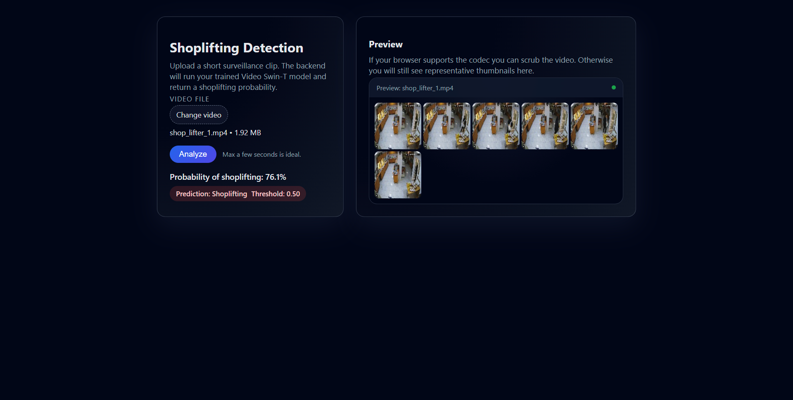
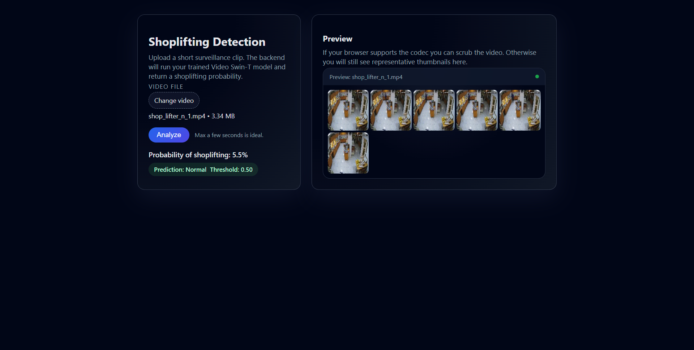

# Task 8 — Shoplifting Detection Web Demo

This folder contains a **Django backend** + **simple frontend** to run inference with the trained model checkpoint:

- `Task 7/pipeline_outputs/video_swin_best.pth`

## What you can do

- Upload a video clip
- Get a JSON prediction from `/api/predict/`
- Preview the clip:
  - If the browser supports the codec, the `<video>` player works
  - Otherwise, the app shows server-generated frame thumbnails via `/api/preview/`

## Setup (Windows / PowerShell)

From `Task 8`:

```bash
python -m pip install -r requirements.txt
python manage.py migrate
python manage.py runserver
```

Then open `http://127.0.0.1:8000/`.

## Screenshots





